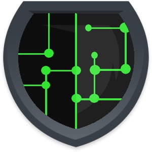

= Discord Dungeons API Wrappers
[cols="2*a", options="header"]
|===
|Status
|Name

|In Progress
a|link:https://github.com/DiscordDungeons/api/tree/ruby[Ruby]

|Planned
|Node

|Planned
|Python

|Planned
|Lua

|===
